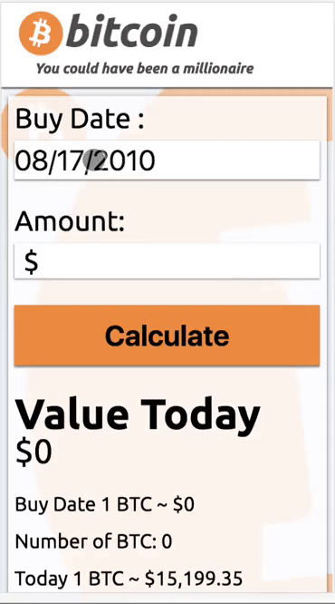

# [Taste the FOMO](http://www.tastethefomo.com)

**Taste the fomo** is a mobile web app that enables users to easily see how much money they would have, had they bought Bitcoin at a chosen date .

## Mission
Any time Bitcoin is discussed someone always says I’d be sooooo rich if I bought X dollars worth of Bitcoin on X date.  The goal of this project is to show the user exactly how rich they would have been had they bought x dollars worth of Bitcoin on X date.

## Getting Started
Getting started is easy just navigate to [www.TasteTheFOMO.com](http://www.tastethefomo.com) , pick a date and enter a buy amount, the app will return the amount of money you'd have today for that buy in.

## App Effectiveness
Just give it a try yourself and you will see how effective it is..... Do you taste that FOMO? Does it taste just like Scott Tenorman's tears?

 

## Usability and Testing
A major part of this project was to ensuring the app was simple and intuitive to use. Throughout the development of this project many ideas were tested in the field before they were pushed to the production version of this app. Testing beta versions allowed optimization of unforeseen pains using the app, allowing for a much better user experience on production versions.

## Contributors
- [George Czurlanis](https://github.com/georgecode) App author and sufferer of the Crypto FOMO.

## Future features
In the future I’d like to add many more coins and tokens.